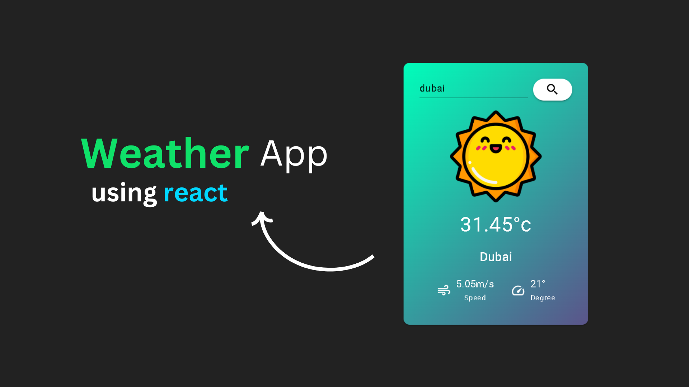

# WeatherComponent



WeatherComponent is a React component that allows users to display current weather information based on their geolocation or a specific location.

## Features

- Fetches weather data from the OpenWeatherMap API.
- Displays weather information such as temperature, wind speed, humidity, and pressure.
- Supports geolocation-based weather fetching.
- Allows users to search for weather by location.

## Installation

To use the WeatherComponent in your React project, follow these steps:

1. Install the package using npm:

   ```sh
   npm install @mui/material @mui/icons-material
   ```

2. Import the WeatherComponent in your project:

   ```javascript
   import WeatherComponent from './WeatherComponent';
   ```

3. Use the `<WeatherComponent />` component in your JSX:

   ```jsx
   <WeatherComponent />
   ```

## Usage

The WeatherComponent can be used as follows:

```jsx
<WeatherComponent />
```

## API Key

To use the OpenWeatherMap API, you need to obtain an API key from their website. Once you have the API key, replace the `API_KEY` variable in the WeatherComponent file with your own API key.

## Credits

- Icons made by [Freepik](https://www.freepik.com) from [www.flaticon.com](https://www.flaticon.com)
